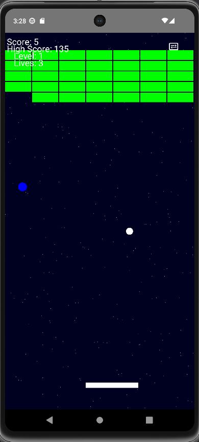

# 🧱 Arkanoid Game

> **Android Arkanoid-style game** developed in Java with colorful blocks, power-ups, level system, score, music, and sound effects.

📱 A retro mobile remake of the classic Arkanoid/Breakout with extra features!

---

## 🧩 Χαρακτηριστικά / Features

- 🎮 Paddle, bouncing ball, and destructible blocks  
- 🔊 Background music and SFX (with toggle)  
- 🌈 Power-ups (multi-ball, paddle size, slow motion)  
- 📈 Level progression system  
- 💾 High score tracking  
- ⏸️ Pause & resume system  
- 🧱 Color-coded blocks  
- 🖼️ Custom launcher icon  

---

## 🖼️ Screenshot

<p align="center">
  
</p>

---

## 🚀 Εγκατάσταση / Installation

1. Clone το repo:
   ```bash
   git clone https://github.com/stelaras36/ArkanoidGame.git
   ---

### 🔑 Keywords
`arkanoid` `android-game` `retro-game` `java-game` `power-ups` `breakout` `brick-breaker` `game-development` `android-studio` `mobile-game` `2d-game` `open-source` `fun-project` `stelaras36`

